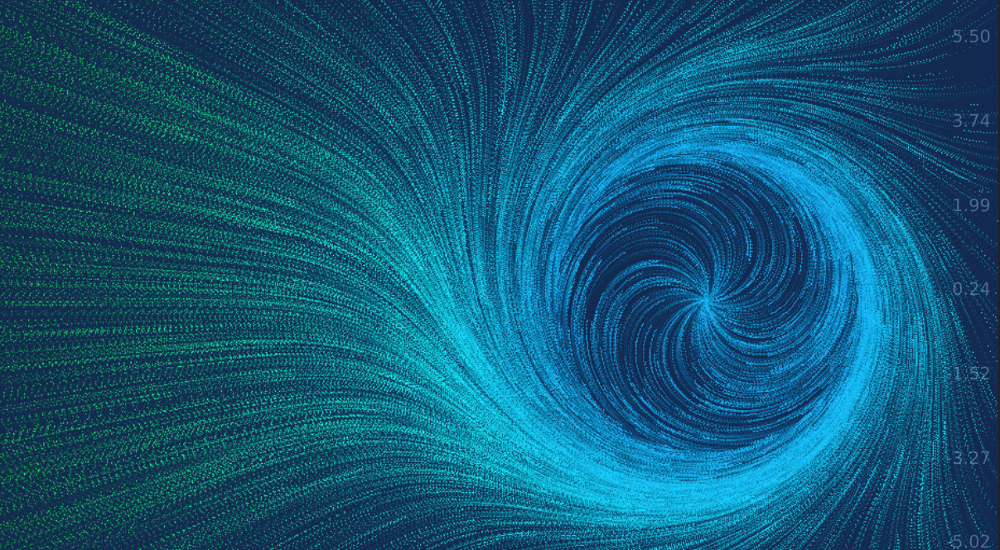

Recently, I came across https://anvaka.github.io/fieldplay which is a pretty nifty platform to toy with vector fields online.

The blackhole I am going to render today is a composition of several simple vector fields.
First, we want to show the effect of the enormous gravity field of the blackhole from afar,
which would look like the electric field from a negatively charged particle,
where all the vectors point inward.
Here, we only care about the visual effects so only the direction is important.
Suppose $\vec p$ represents the position relative to the origin of the coordinate system, the vector field is:

$$
\vec v = - \vec p
$$

Simple, eh?

To write this in GLSL and render with the given framework, we basically need to define such a velocity field:

```glsl
vec2 get_velocity(vec2 p) {
  return -p;
}
```

Next we establish the event horizon at $r=\pi$.

```glsl
vec2 get_velocity(vec2 p) {
  float pi = 3.14159;
  if (length(p)<pi)
  	return vec2(0., 0.);
  else
    return -p;
}
```

To make this a cooler rotating blackhole, we can blend in some rotation as well.
As a reminder, the 2D rotation matrix is:

$$
R_\theta = \left(
\begin{matrix}
    \cos \theta && - \sin \theta \\
    \sin \theta &&  \cos \theta
\end{matrix}
\right)
$$

where $\theta$ is the counterclockwise rotation angle.

Let's study a simple rotational vector field:

$$
\vec v = R_{\frac{\pi}{2}} \vec p
$$

```glsl
vec2 get_velocity(vec2 p) {
  vec2 v = vec2(0., 0.);
  float pi = 3.14159;
  if (length(p)<pi)
  	return v;
  else {
    v.x = -p.y;
    v.y = p.x;
    return v;
  }
}
```

And you should see everything rotating about the origin counterclockwise.

The range that we want would be $\theta \in (\frac{\pi}{2}, \pi)$, where everything is still pointing inward while the vector field is rotating counterclockwise.

```glsl
vec2 get_velocity(vec2 p) {
  vec2 v = vec2(0., 0.);
  float pi = 3.14159;
  float theta = pi * .75;
  if (length(p)<pi)
  	return v;
  else {
    v.x = cos(theta)*p.x-sin(theta)*p.y;
    v.y = sin(theta)*p.x+cos(theta)*p.y;
    return v;
  }
}
```

Now we make this angle a sigmoid function of radius to have the vector field rotate progressively and become almost tangent to the event horizon as it is approaching.
To this end, we will use the following sigmoid function:

$$
\phi (x) = \frac{1}{1+e^{-x}}
$$

It has these nice properties:

$$
\lim _ {x \to \infty} \phi (x) = 1
$$

$$
\lim _ {x \to -\infty} \phi (x) = 0
$$

$$
\phi (x) + \phi (-x) = 1
$$

Thus, we can scale and shift this function to implement the relation between the rotational angle and radius, namely we want:

$$
\theta = \frac{\pi}{2} \phi (r-2\pi) + \frac{\pi}{2}
$$

```glsl
vec2 get_velocity(vec2 p) {
  vec2 v = vec2(0., 0.);
  float pi = 3.14159;

  // only changed this line
  float theta = pi/2.*phi(length(p)-2.*pi)+pi/2.;

  if (length(p)<pi)
  	return v;
  else {
    v.x = cos(theta)*p.x-sin(theta)*p.y;
    v.y = sin(theta)*p.x+cos(theta)*p.y;
    return v;
  }
}
```

Then I applied some similar tricks to the interior of the blackhole. That was fun.



Final results see also [Live Demo](https://anvaka.github.io/fieldplay/?cx=-8.7899&cy=0.23650000000000038&w=31.0606&h=31.0606&dt=0.01&fo=0.99&dp=0.005&cm=2&vf=float%20phi%28float%20x%29%20%7B%0A%20%20return%201.%2F%281.%2Bexp%28-x%29%29%3B%0A%7D%0A%0Avec2%20get_velocity%28vec2%20p%29%20%7B%0A%20%20vec2%20v%20%3D%20vec2%280.%2C%200.%29%3B%0A%20%20float%20pi%20%3D%203.14159%3B%0A%20%20float%20alpha%20%3D%20pi%2F2.*phi%28length%28p%29-2.*pi%29%2Bpi%2F2.%3B%0A%20%20if%20%28length%28p%29%3Cpi%29%20%7B%0A%20%20%20%20alpha%20%3D%20pi%2F2.*phi%281.6*%28pi%2F2.-length%28p%29%29%29%2Bpi%2F2.%3B%0A%20%20%7D%0A%20%20else%20%7B%0A%20%20%20%20alpha%20%3D%20pi%2F2.*phi%28length%28p%29-2.*pi%29%2Bpi%2F2.%3B%0A%20%20%20%20alpha%20%3D%20-%20alpha%3B%0A%20%20%7D%0A%20%20v.x%20%3D%20cos%28alpha%29*p.x%2Bsin%28alpha%29*p.y%3B%0A%20%20v.y%20%3D%20-sin%28alpha%29*p.x%2Bcos%28alpha%29*p.y%3B%0A%20%20if%20%28length%28p%29%3Cpi%29%20%7B%0A%20%20%20%20vec2%20u%20%3D%20vec2%280.%2C%200.%29%3B%0A%20%20%20%20u.x%20%3D%20v.x%2Flength%28v%29%3B%0A%20%20%09u.y%20%3D%20v.y%2Flength%28v%29%3B%0A%20%20%20%20return%20u*pi%3B%0A%20%20%7D%0A%20%20else%20%7B%0A%20%20%20%20return%20v%3B%0A%20%20%7D%0A%7D&code=float%20phi%28float%20x%29%20%7B%0A%20%20return%201.%2F%281.%2Bexp%28-x%29%29%3B%0A%7D%0A%0Avec2%20get_velocity%28vec2%20p%29%20%7B%0A%20%20vec2%20v%20%3D%20vec2%280.%2C%200.%29%3B%0A%20%20float%20pi%20%3D%203.14159%3B%0A%20%20float%20alpha%20%3D%20pi%2F2.*phi%28length%28p%29-2.*pi%29%2Bpi%2F2.%3B%0A%20%20if%20%28length%28p%29%3Cpi%29%20%7B%0A%20%20%20%20alpha%20%3D%20pi%2F2.*phi%281.6*%28pi%2F2.-length%28p%29%29%29%2Bpi%2F2.%3B%0A%20%20%7D%0A%20%20else%20%7B%0A%20%20%20%20alpha%20%3D%20pi%2F2.*phi%28length%28p%29-2.*pi%29%2Bpi%2F2.%3B%0A%20%20%20%20alpha%20%3D%20-%20alpha%3B%0A%20%20%7D%0A%20%20v.x%20%3D%20cos%28alpha%29*p.x%2Bsin%28alpha%29*p.y%3B%0A%20%20v.y%20%3D%20-sin%28alpha%29*p.x%2Bcos%28alpha%29*p.y%3B%0A%20%20if%20%28length%28p%29%3Cpi%29%20%7B%0A%20%20%20%20vec2%20u%20%3D%20vec2%280.%2C%200.%29%3B%0A%20%20%20%20u.x%20%3D%20v.x%2Flength%28v%29%3B%0A%20%20%09u.y%20%3D%20v.y%2Flength%28v%29%3B%0A%20%20%20%20return%20u*pi%3B%0A%20%20%7D%0A%20%20else%20%7B%0A%20%20%20%20return%20v%3B%0A%20%20%7D%0A%7D) and [Gist](https://gist.github.com/aleozlx/69f84ac008f4ab22fbbcd6960ca53fa0)

Ps. some cool reads

https://blogs.futura-sciences.com/e-luminet/tag/black-hole/

https://www.blendernation.com/2015/02/17/behind-the-scenes-gargantua/
