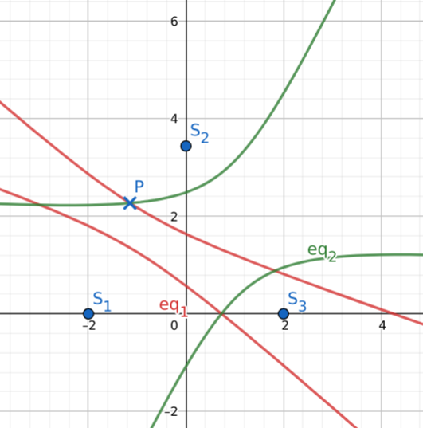
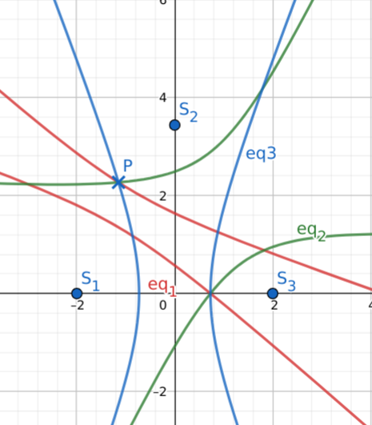
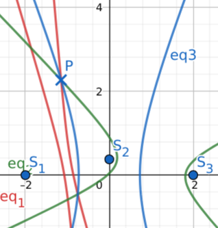
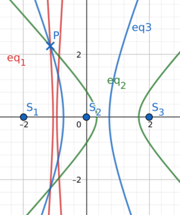
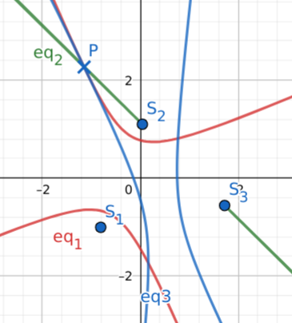

Word has it, this was how navigation systems worked in the world wars.
It was designed for the scenario where the time is only synchronized between base stations whereas not necessarily the case between any base station and the target to be localized.
This navigation scheme usually was used with some inherent ambiguity, which also required an elimination strategy,
but today we are going to study it without such assumption.

As mentioned, the base stations which simultaneously emit radio signals are asynchronous with the target in question.
Therefore, only the timing differences $|t_1-t_2|$ are known variables.
Then with the assumption that the radio waves travel in a constant velocity $c$, the distance differences are known too.

$$
|r_1-r_2| = c|t_1-t_2|
$$

The key mechanism that allows us to navigate with such information is the fact that such condition narrows down the possible location to be lying on the curve of a hyperbola.
Use more base stations, and we can get the hyperbola to intersect and further narrow it down to several points.

Apart from this we also know the location of the base stations $S_k$.

Picking an arbitrary cartesian coordinate frame $(x, y)$, with bases $(\vec e_1, \vec e_2)$, we will first derive the coordinate transformation between stations.
Having a pair of base stations $S_i$ and $S_j$ as foci of the hyperbola, which lie on the horizontal axis on their local coordinate frame $(\xi_{\iota(i, j)}, \psi_{\iota(i, j)})$ and center at the local origin,
we can find:

1) the angle $\alpha_\iota$ betwen $x$ axis and $\xi_\iota$ axis

$$
\alpha_\iota (S_i, S_j) =\text{sgn}((S_j-S_i) \cdot \vec e_2) \arccos { \frac{(S_j-S_i) \cdot \vec e_1}{\left|S_j-S_i\right|} }
$$

2) the local origin $O_\iota$

$$
O_\iota (S_i, S_j) = \frac{S_i+S_j}{2}
$$

If we perceive the coordinate transform from our arbitrarily chosen coordinate frame to the base station local coordinate frame as a translation $t_\iota=O_\iota$ and a rotation $R_{\alpha_\iota}$,
then all points in the $(\xi, \psi)$ coordinate frame have to compensate for that in order to be expressed in terms of $(x, y)$, hence the name contravariant vectors:

$$
\left(\begin{matrix}\xi_{\iota} \\ \psi_{\iota} \\ 1\end{matrix}\right) 
 =
\left(\begin{matrix}
    R_{\alpha_\iota} &&  t_\iota \\
    0^T && 1
\end{matrix} \right)^{-1} X
=
\left(\begin{matrix}
    R_{\alpha_\iota} ^ {T} && -R_{\alpha_\iota} ^ {T} t_\iota \\
    0^T && 1
\end{matrix} \right) \left(\begin{matrix}x \\ y \\1\end{matrix}\right)
$$

This gives us:

$$
\xi_{\iota}(x,y) = \cos(\alpha_\iota) (x - O_\iota \cdot \vec e_1) + \sin(\alpha_\iota) (y - O_\iota \cdot \vec e_2)
$$

$$
\psi_{\iota}(x,y) = -\sin(\alpha_\iota) (x - O_\iota \cdot \vec e_1) + \cos(\alpha_\iota) (y - O_\iota \cdot \vec e_2)
$$

Consequently, we have the hyperbolas (between stations $S_i$ and $S_j$):

$$
C_{\iota(i, j)} : \quad \frac{\xi_{\iota}^2}{a_{\iota}^2} - \frac{\psi_{\iota}^2}{f_{\iota}^2 - a_{\iota}^2} = 1
$$

where

$$
a_{\iota(i, j)} = \frac{|r_i-r_j|}{2}
$$

$$
f_{\iota(i, j)} = \frac{|S_i-S_j|}{2}
$$

In quadratic form, the intersections of conics $C_\iota$ simultaneously satisfy the system of equations:

$$
X^T C_\iota X = 0
$$

> For some theoratical background on the solution (called an algebraic variety) to this, see also
> * https://math.stackexchange.com/questions/2542039/solving-a-system-of-generic-quadratic-forms
> * https://math.stackexchange.com/questions/1767225/algorithm-intersection-of-two-conics

With two station pairs (two hyperbola equations), this _generally_ results in 4 solutions:

This picture has shown how the hyperbolas between $S_1$ and $S_2$, and between $S_2$ and $S_3$ intersect.

But we know that from $n$ stations we can form at most $\frac{n (n-1)}{2}$ pairs, like this:

This picture has shown how the hyperbolas between any pair of the 3 stations intersect, which _generally_ results in 2 solutions (where all 3 hyperbolas intersect).

In fact the ambiguity is almost maximized when the target is inside of the triangle region formed by the 3 stations, because then, both of them are "somewhere inside".
To eliminate the ambiguity, we can either add more stations or break the symmetry, so that only one of them can be practically true.
For example, changing the configuration from an eqilateral triangle to a bilateral triangle:

Now the false solution is too close to the stations and is also on the other side of the x-axis.

Or have the stations in the same line, then the solutions will be reflective about the line and clearly separated.
The downside being, if the target can actually go to the other side of the 3 stations, then there is no way to distinguish which side like this.

If the locations of the station can be dynamic, we can also create a degenerate case where there is a unique solution, for example:

I can have the target be aligned with two of the stations and this creates a unique solution.
Imagine if the 3 stations were installed on a rotatable platform, then this should be feasible.
In fact, using some tracking and filtering technique, it should be enough to produce a unique and precise location of the target.

Lastly, I share with you this experiment made on GeoGebra:

https://www.geogebra.org/graphing/rhjsvpsh

