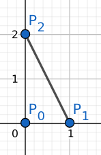
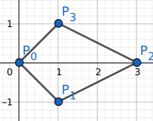
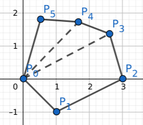

These are my study notes on _Image Moments_ using OpenCV.
They are interesting because they provide much important shape information about the region enclosed by the contour,
such as Area, Centroid, Covariance, Eigenvector directions, Eigenvalues, Eccentricity, Scale/Rotation/Translation-invariant Hu Moments, etc.

## How does it work?

It claims to be capable of computing various kinds of _Moments_ efficiently through a given contour using the _Green Formula_,
so I dug up the [code](https://github.com/opencv/opencv/blob/master/modules/imgproc/src/moments.cpp) and saw such a summation (left hand side) to compute the area.
Immediately, I had questions like: Is this the discrete form of the _Green Formula_? How are they connected? Or is the following true (for polygons)?

$$
\frac{1}{2} \sum_i x_{i-1} y_i - x_i y_{i-1} = \frac{1}{2} \oint_C (x \mathrm{d}y - y \mathrm{d}x)
$$

Now let's use four area calculation examples to verify that this is true.
As area is not a quantity that should depend on the choice of coordinate system,
without loss of generality, we assume the contour $C$ passes through the origin, i.e. $(0,0) \in C$.

**Example 1**

$$
A = \frac{1}{2} (0-0 + 0-0 + 1 \times 2 - 0) = 1
$$

The intuition we gained from here is that this (aka the [Shoelace Formula](https://en.wikipedia.org/wiki/Shoelace_formula)) works because it is equivalent to a half of the area of the parallelogon(s).
To put it another way,

$$
A = \frac{1}{2} \left(\left|\begin{matrix}0&&2\\0&&0\end{matrix}\right| + \left|\begin{matrix}0&&0\\1&&0\end{matrix}\right| + \left|\begin{matrix}1&&0\\0&&2\end{matrix}\right|\right)
$$

But yikes, the determinant form is way cooler and more mnemonic.

$$
A = \frac{1}{2} \sum_i \det \left(\begin{matrix}P_{i-1}^T\\P_i^T\end{matrix}\right)
$$

**Example 2**

$$
A = \frac{1}{2} \left(\left|\begin{matrix}1&&-1\\3&&0\end{matrix}\right| + \left|\begin{matrix}3&&0\\1&&1\end{matrix}\right|\right) = 3
$$

**Example 3**

As an logical extension to any polygons:

$$
A = \sum_i A\left(P_{i-1}, P_i\right) = \frac{1}{2} \sum_i \det \left(\begin{matrix}P_{i-1}^T\\P_i^T\end{matrix}\right)
$$

**Example 4**

Towards the limit of a "continuous shape":

$$
A = \frac{1}{2} \oint_C \det \left(\begin{matrix}x&&y\\x+dx&&y+dy\end{matrix}\right)
= \frac{1}{2} \oint_C (x \mathrm{d}y - y \mathrm{d}x)
= \iint_D \mathrm{d}x\mathrm{d}y
$$

Up to this point, it is shown that the initial conjecture is correct.
In pt. II, it will be generalized to calculating higher order moments through Green's theorem.
Specifically, we will study

$$
\oint_C f(x,y) \det \left( \begin{matrix}x && y \\ \mathrm{d}x && \mathrm{d}y\end{matrix}\right)
$$

where $f(x,y) = x^\alpha y^\beta$.
