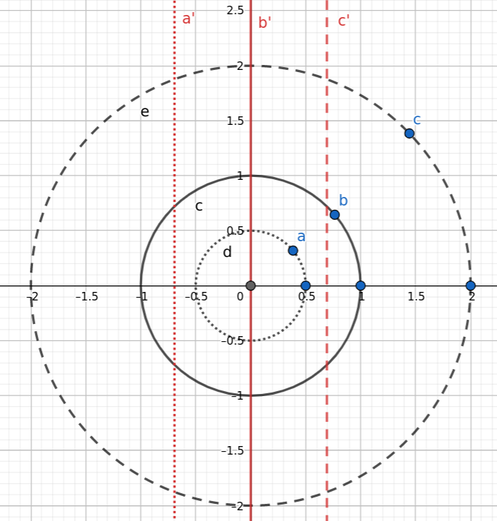
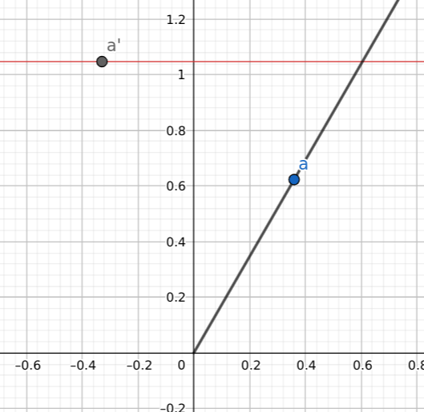
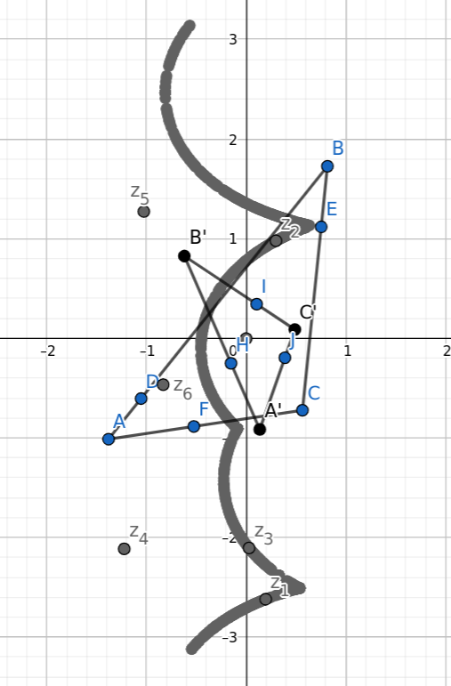
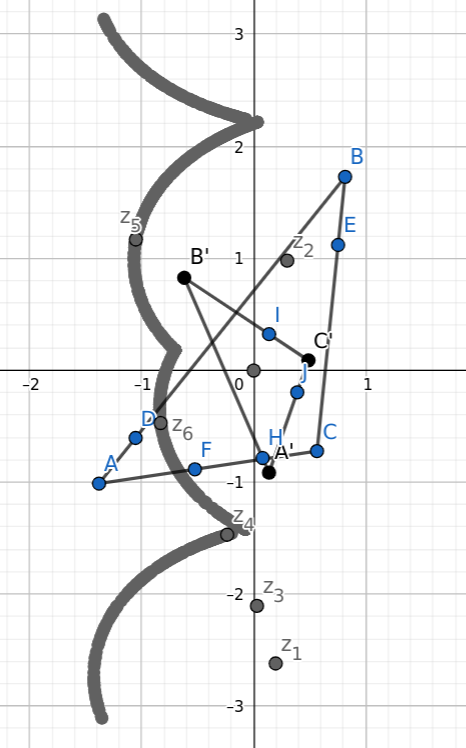

Remarks reading _Needham, Tristan. Visual complex analysis. Oxford University Press, 1998._

## log(z) Transform

The $\log(z)$ transform is intended to be the inverse of the $e^z$ transform.
The latter is well known for its vivid demonstrations of a few beautiful things in maths,
such as Euler's Formula, its deceptively simple Taylor series, and solution to many $1^\infty$ type of limits.
What do we have to gain from the inverse transform, $\log(z)$? - A way of getting rotation and scale invariances!
I wanted to point out the fact that this coincides with the log-polar transform in Computer Vision,
which appears to be two side of the same coin, and that in the realm of Complex Analysis, it comes so naturally as an essential kind of complex transformation.

$$
e^{\log(z)} = z
$$

$$
\log(z) = \ln \left| z \right| + i \arg(z)
$$

> Note of a technical detail: it takes infinitely many values, separated by $2 \pi i$, due to the periodicity of $e^z$ transform. And it has a branching point as well as singularity at the origin.

As it is a transform that takes infinitely many values, we only focus on its principal branch.

$$
\log(\rho \cos \theta + i \rho \sin \theta) = \log(\rho e^{i \theta}) = \ln \rho + i \theta
$$

Let's illustrate its useful geometrical properties with a few pictures.

## Property 1: Circles => Vertical lines

The first is the usage as a rotational invariance. Suppose $\rho > 0$:

$$
\log(\rho \cos \theta + i \rho \sin \theta) = \ln \rho + i \theta
$$

If a point is travelling along a circle with radius $\rho$ centered at the origin, its trajectory will be transformed into a vertical line $x=\ln \rho$.
This gives us a hint as to how it can transform a seemly delicate geometry into one that can hardly be any simpler.
More specifically, in the context of object recognition, an object's rotation will manifest as vertical translation in the transformed picture.

## Property 2: Rays from origin => Horizontal lines

Actually it is the same formular, but this time view $\rho$ as the variable.

$$
\log(\rho \cos \theta + i \rho \sin \theta) = \ln \rho + i \theta
$$

Keep in mind that $\rho > 0$, so the point represents a ray from the origin.
The transformed point traces out a horizontal line $y=\theta$.
This also means that an object's scaling will be converted into a horizontal translation.

## Result

If we show how this transforms a triangle, we can show how this will transform any 2D geometry.
Below, I have drawn two similar triangles centered at the origin, where A, B, C were arbitrarily chosen.

$$
\triangle A'B'C' = \frac{1}{2}e^{\frac{\pi}{3}i} \triangle ABC
$$

Then $\log \triangle ABC$ is traced into the bold grey curve in first picture, and $\log \triangle A'B'C'$ is in the second.

These strange looking periodical curves are a mere translation of each other.

If you are not visually convinced, let's substract:

$$
\log \triangle A'B'C' - \log \triangle ABC = \log \frac{\triangle A'B'C'}{\triangle ABC} = \log \frac{\frac{1}{2}e^{\frac{\pi}{3}i} \triangle ABC}{\triangle ABC} = \log \frac{1}{2} + \frac{\pi}{3}i
$$

Neat! In other words, the two transformed geometries are only off by a constant, or visually, a translation.
Matching these two curves will be an easy task, the real catch is that we would need the two objects in question both centered at the origin before $\log(z)$ transform.

**Referneces**

* Needham, Tristan. Visual complex analysis. Oxford University Press, 1998, p98.
* https://sthoduka.github.io/imreg_fmt/docs/log-polar-transform/
* https://docs.opencv.org/2.4/modules/imgproc/doc/geometric_transformations.html#logpolar
